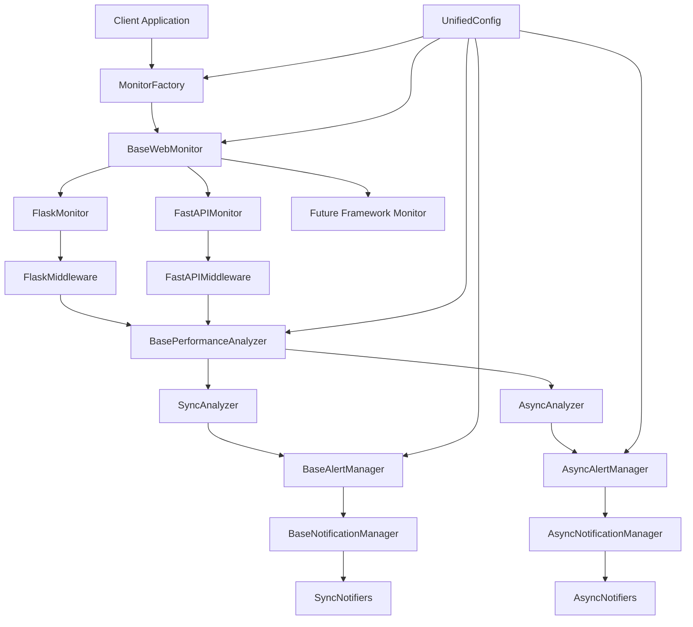

# Design Document

## Overview

FastAPI集成和多框架支持设计旨在扩展现有的web性能监控工具，添加对FastAPI异步框架的支持，并重构架构以支持多个Python web框架。设计采用面向对象的设计原则，通过抽象基类、继承和多态实现高内聚低耦合的架构，同时保持向后兼容性和异步性能。

**设计理念**：
- **统一抽象**：通过抽象基类定义统一的监控器接口
- **框架特化**：每个web框架有专门的实现类处理框架特有逻辑
- **异步优先**：FastAPI集成完全支持异步操作和并发处理
- **向后兼容**：现有Flask集成保持完全兼容
- **可扩展性**：新框架可通过继承基类轻松添加

## Architecture

### 系统架构图



### 核心设计模式

1. **抽象工厂模式**：MonitorFactory根据框架类型创建相应监控器
2. **模板方法模式**：BaseWebMonitor定义监控流程，子类实现具体步骤
3. **策略模式**：不同的性能分析策略（同步/异步）
4. **观察者模式**：告警管理器观察性能指标变化
5. **适配器模式**：统一不同框架的请求/响应接口

## Components and Interfaces

### 1. 核心抽象层

#### BaseWebMonitor (抽象监控器基类)
```python
from abc import ABC, abstractmethod
from typing import Callable, Any, Dict, Optional
import asyncio
from .config import UnifiedConfig
from .analyzer import BasePerformanceAnalyzer
from .alerts import BaseAlertManager

class BaseWebMonitor(ABC):
    """Web框架监控器抽象基类
    
    定义所有web框架监控器的统一接口和公共逻辑
    """
    
    def __init__(self, config: UnifiedConfig):
        self.config = config
        self.analyzer = self._create_analyzer()
        self.alert_manager = self._create_alert_manager()
        self._monitoring_enabled = True
        self._stats = MonitoringStats()
    
    @abstractmethod
    def create_middleware(self) -> Callable:
        """创建框架特定的中间件"""
        pass
    
    @abstractmethod
    def create_decorator(self) -> Callable:
        """创建框架特定的装饰器"""
        pass
    
    @abstractmethod
    def _extract_request_info(self, request_context: Any) -> RequestInfo:
        """从框架特定的请求上下文中提取信息"""
        pass
    
    @abstractmethod
    def _create_analyzer(self) -> BasePerformanceAnalyzer:
        """创建框架特定的性能分析器"""
        pass
    
    @abstractmethod
    def _create_alert_manager(self) -> BaseAlertManager:
        """创建框架特定的告警管理器"""
        pass
    
    # 公共方法 - 模板方法模式
    def _monitor_execution(self, execution_context: ExecutionContext) -> Any:
        """监控执行的通用流程"""
        if not self._monitoring_enabled:
            return execution_context.execute()
        
        start_time = time.perf_counter()
        profiler = None
        result = None
        exception_occurred = False
        
        try:
            profiler = self.analyzer.start_profiling()
            result = execution_context.execute()
        except Exception as e:
            exception_occurred = True
            raise
        finally:
            self._finalize_monitoring(
                profiler, start_time, execution_context, 
                exception_occurred
            )
        
        return result
    
    def _finalize_monitoring(self, profiler, start_time: float, 
                           context: ExecutionContext, exception_occurred: bool):
        """完成监控处理的通用逻辑"""
        try:
            end_time = time.perf_counter()
            total_time = end_time - start_time
            
            if profiler:
                execution_time = self.analyzer.get_execution_time(profiler)
                html_report = self.analyzer.stop_profiling(profiler)
                
                # 更新统计
                self._stats.update(execution_time, exception_occurred)
                
                # 处理告警
                if execution_time > self.config.threshold_seconds:
                    self._process_alert(context, execution_time, html_report)
                    
        except Exception as e:
            self.logger.error(f"监控处理失败: {e}")
    
    def _process_alert(self, context: ExecutionContext, 
                      execution_time: float, html_report: str):
        """处理告警的通用逻辑"""
        metrics = self._create_performance_metrics(context, execution_time)
        self.alert_manager.process_alert(metrics, html_report)
    
    # 公共接口方法
    def get_stats(self) -> Dict[str, Any]:
        """获取监控统计信息"""
        return self._stats.to_dict()
    
    def enable_monitoring(self) -> None:
        """启用监控"""
        self._monitoring_enabled = True
    
    def disable_monitoring(self) -> None:
        """禁用监控"""
        self._monitoring_enabled = False
    
    def cleanup(self) -> None:
        """清理资源"""
        self.alert_manager.cleanup()
```

#### ExecutionContext (执行上下文)
```python
from abc import ABC, abstractmethod
from typing import Any, Callable, Dict

class ExecutionContext(ABC):
    """执行上下文抽象类，封装不同类型的执行环境"""
    
    @abstractmethod
    def execute(self) -> Any:
        """执行具体操作"""
        pass
    
    @abstractmethod
    def get_request_info(self) -> RequestInfo:
        """获取请求信息"""
        pass

class RequestExecutionContext(ExecutionContext):
    """HTTP请求执行上下文"""
    
    def __init__(self, app: Any, request_data: Any, monitor: BaseWebMonitor):
        self.app = app
        self.request_data = request_data
        self.monitor = monitor
    
    def execute(self) -> Any:
        # 由具体框架实现
        pass
    
    def get_request_info(self) -> RequestInfo:
        return self.monitor._extract_request_info(self.request_data)

class FunctionExecutionContext(ExecutionContext):
    """函数执行上下文"""
    
    def __init__(self, func: Callable, args: tuple, kwargs: dict):
        self.func = func
        self.args = args
        self.kwargs = kwargs
    
    def execute(self) -> Any:
        return self.func(*self.args, **self.kwargs)
    
    def get_request_info(self) -> RequestInfo:
        return RequestInfo.from_function(self.func, self.args, self.kwargs)
```

### 2. Flask监控器实现

#### FlaskMonitor (Flask特定实现)
```python
from .base import BaseWebMonitor, RequestExecutionContext, FunctionExecutionContext
from .analyzer import SyncPerformanceAnalyzer
from .alerts import SyncAlertManager

class FlaskMonitor(BaseWebMonitor):
    """Flask框架监控器实现"""
    
    def create_middleware(self) -> Callable:
        """创建Flask WSGI中间件"""
        def middleware(app):
            def wsgi_wrapper(environ, start_response):
                context = FlaskRequestContext(app, environ, start_response, self)
                return self._monitor_execution(context)
            return wsgi_wrapper
        return middleware
    
    def create_decorator(self) -> Callable:
        """创建Flask装饰器"""
        def decorator(func: Callable) -> Callable:
            @functools.wraps(func)
            def wrapper(*args, **kwargs):
                context = FunctionExecutionContext(func, args, kwargs)
                return self._monitor_execution(context)
            return wrapper
        return decorator
    
    def _extract_request_info(self, environ: dict) -> RequestInfo:
        """从WSGI环境中提取请求信息"""
        # 复用现有的Flask请求信息提取逻辑
        method = environ.get('REQUEST_METHOD', 'GET')
        path = environ.get('PATH_INFO', '/')
        query_string = environ.get('QUERY_STRING', '')
        
        # ... 详细的请求信息提取逻辑
        
        return RequestInfo(
            endpoint=path,
            method=method,
            url=self._build_url(environ),
            params=self._extract_params(environ),
            headers=self._extract_headers(environ)
        )
    
    def _create_analyzer(self) -> BasePerformanceAnalyzer:
        """创建同步性能分析器"""
        return SyncPerformanceAnalyzer()
    
    def _create_alert_manager(self) -> BaseAlertManager:
        """创建同步告警管理器"""
        return SyncAlertManager(self.config)

class FlaskRequestContext(RequestExecutionContext):
    """Flask请求执行上下文"""
    
    def __init__(self, app, environ, start_response, monitor):
        super().__init__(app, environ, monitor)
        self.start_response = start_response
        self.status_code = [200]
    
    def execute(self) -> Any:
        """执行Flask WSGI应用"""
        def custom_start_response(status, headers, exc_info=None):
            try:
                self.status_code[0] = int(status.split()[0])
            except (ValueError, IndexError):
                self.status_code[0] = 200
            return self.start_response(status, headers, exc_info)
        
        app_iter = self.app(self.request_data, custom_start_response)
        
        try:
            for data in app_iter:
                yield data
        finally:
            if hasattr(app_iter, 'close'):
                app_iter.close()
```

### 3. FastAPI监控器实现

#### FastAPIMonitor (FastAPI特定实现)
```python
import asyncio
from fastapi import Request, Response
from starlette.middleware.base import BaseHTTPMiddleware
from .base import BaseWebMonitor, RequestExecutionContext, FunctionExecutionContext
from .analyzer import AsyncPerformanceAnalyzer
from .alerts import AsyncAlertManager

class FastAPIMonitor(BaseWebMonitor):
    """FastAPI框架监控器实现"""
    
    def create_middleware(self) -> Callable:
        """创建FastAPI中间件类"""
        monitor = self
        
        class PerformanceMiddleware(BaseHTTPMiddleware):
            async def dispatch(self, request: Request, call_next):
                context = FastAPIRequestContext(request, call_next, monitor)
                if asyncio.iscoroutinefunction(monitor._monitor_execution):
                    return await monitor._monitor_execution_async(context)
                else:
                    # 适配同步监控方法到异步环境
                    return await asyncio.get_event_loop().run_in_executor(
                        None, monitor._monitor_execution, context
                    )
        
        return PerformanceMiddleware
    
    def create_decorator(self) -> Callable:
        """创建FastAPI异步装饰器"""
        def decorator(func: Callable) -> Callable:
            if asyncio.iscoroutinefunction(func):
                @functools.wraps(func)
                async def async_wrapper(*args, **kwargs):
                    context = AsyncFunctionExecutionContext(func, args, kwargs)
                    return await self._monitor_execution_async(context)
                return async_wrapper
            else:
                @functools.wraps(func)
                def sync_wrapper(*args, **kwargs):
                    context = FunctionExecutionContext(func, args, kwargs)
                    return self._monitor_execution(context)
                return sync_wrapper
        return decorator
    
    async def _monitor_execution_async(self, execution_context: ExecutionContext) -> Any:
        """异步监控执行流程"""
        if not self._monitoring_enabled:
            if hasattr(execution_context, 'execute_async'):
                return await execution_context.execute_async()
            else:
                return execution_context.execute()
        
        start_time = time.perf_counter()
        profiler = None
        result = None
        exception_occurred = False
        
        try:
            profiler = await self.analyzer.start_profiling_async()
            if hasattr(execution_context, 'execute_async'):
                result = await execution_context.execute_async()
            else:
                result = execution_context.execute()
        except Exception as e:
            exception_occurred = True
            raise
        finally:
            await self._finalize_monitoring_async(
                profiler, start_time, execution_context, exception_occurred
            )
        
        return result
    
    async def _finalize_monitoring_async(self, profiler, start_time: float,
                                       context: ExecutionContext, exception_occurred: bool):
        """异步完成监控处理"""
        try:
            end_time = time.perf_counter()
            total_time = end_time - start_time
            
            if profiler:
                execution_time = await self.analyzer.get_execution_time_async(profiler)
                html_report = await self.analyzer.stop_profiling_async(profiler)
                
                # 更新统计
                self._stats.update(execution_time, exception_occurred)
                
                # 异步处理告警
                if execution_time > self.config.threshold_seconds:
                    await self._process_alert_async(context, execution_time, html_report)
                    
        except Exception as e:
            self.logger.error(f"异步监控处理失败: {e}")
    
    async def _process_alert_async(self, context: ExecutionContext,
                                 execution_time: float, html_report: str):
        """异步处理告警"""
        metrics = self._create_performance_metrics(context, execution_time)
        await self.alert_manager.process_alert_async(metrics, html_report)
    
    def _extract_request_info(self, request: Request) -> RequestInfo:
        """从FastAPI请求中提取信息"""
        # 提取FastAPI特有的请求信息
        path_params = dict(request.path_params) if hasattr(request, 'path_params') else {}
        query_params = dict(request.query_params) if hasattr(request, 'query_params') else {}
        
        return RequestInfo(
            endpoint=request.url.path,
            method=request.method,
            url=str(request.url),
            params={
                'path_params': path_params,
                'query_params': query_params,
            },
            headers=dict(request.headers)
        )
    
    def _create_analyzer(self) -> BasePerformanceAnalyzer:
        """创建异步性能分析器"""
        return AsyncPerformanceAnalyzer()
    
    def _create_alert_manager(self) -> BaseAlertManager:
        """创建异步告警管理器"""
        return AsyncAlertManager(self.config)

class FastAPIRequestContext(RequestExecutionContext):
    """FastAPI请求执行上下文"""
    
    def __init__(self, request: Request, call_next: Callable, monitor: FastAPIMonitor):
        super().__init__(None, request, monitor)
        self.call_next = call_next
    
    async def execute_async(self) -> Response:
        """异步执行FastAPI请求处理"""
        return await self.call_next(self.request_data)
    
    def execute(self) -> Any:
        """同步执行（不推荐在FastAPI中使用）"""
        # 为了兼容性提供，但不推荐使用
        loop = asyncio.get_event_loop()
        return loop.run_until_complete(self.execute_async())

class AsyncFunctionExecutionContext(FunctionExecutionContext):
    """异步函数执行上下文"""
    
    async def execute_async(self) -> Any:
        """异步执行函数"""
        return await self.func(*self.args, **self.kwargs)
```

### 4. 性能分析器层次结构

#### BasePerformanceAnalyzer (抽象性能分析器)
```python
from abc import ABC, abstractmethod
from typing import Optional, Any
import pyinstrument

class BasePerformanceAnalyzer(ABC):
    """性能分析器抽象基类"""
    
    @abstractmethod
    def start_profiling(self) -> Optional[pyinstrument.Profiler]:
        """开始性能分析"""
        pass
    
    @abstractmethod
    def stop_profiling(self, profiler: pyinstrument.Profiler) -> Optional[str]:
        """停止性能分析并生成HTML报告"""
        pass
    
    @abstractmethod
    def get_execution_time(self, profiler: pyinstrument.Profiler) -> float:
        """获取执行时间"""
        pass

class SyncPerformanceAnalyzer(BasePerformanceAnalyzer):
    """同步性能分析器"""
    
    def start_profiling(self) -> Optional[pyinstrument.Profiler]:
        """开始同步性能分析"""
        try:
            profiler = pyinstrument.Profiler()
            profiler.start()
            return profiler
        except Exception as e:
            logger.error(f"启动性能分析失败: {e}")
            return None
    
    def stop_profiling(self, profiler: pyinstrument.Profiler) -> Optional[str]:
        """停止同步性能分析"""
        try:
            profiler.stop()
            return profiler.output_html()
        except Exception as e:
            logger.error(f"停止性能分析失败: {e}")
            return None
    
    def get_execution_time(self, profiler: pyinstrument.Profiler) -> float:
        """获取同步执行时间"""
        try:
            return profiler.last_session.duration
        except Exception:
            return 0.0

class AsyncPerformanceAnalyzer(BasePerformanceAnalyzer):
    """异步性能分析器"""
    
    async def start_profiling_async(self) -> Optional[pyinstrument.Profiler]:
        """开始异步性能分析"""
        try:
            profiler = pyinstrument.Profiler(async_mode='enabled')
            profiler.start()
            return profiler
        except Exception as e:
            logger.error(f"启动异步性能分析失败: {e}")
            return None
    
    async def stop_profiling_async(self, profiler: pyinstrument.Profiler) -> Optional[str]:
        """停止异步性能分析"""
        try:
            profiler.stop()
            # 在异步环境中生成HTML可能需要特殊处理
            loop = asyncio.get_event_loop()
            html_report = await loop.run_in_executor(None, profiler.output_html)
            return html_report
        except Exception as e:
            logger.error(f"停止异步性能分析失败: {e}")
            return None
    
    async def get_execution_time_async(self, profiler: pyinstrument.Profiler) -> float:
        """获取异步执行时间"""
        try:
            return profiler.last_session.duration
        except Exception:
            return 0.0
    
    # 为了兼容基类接口，提供同步版本
    def start_profiling(self) -> Optional[pyinstrument.Profiler]:
        loop = asyncio.get_event_loop()
        return loop.run_until_complete(self.start_profiling_async())
    
    def stop_profiling(self, profiler: pyinstrument.Profiler) -> Optional[str]:
        loop = asyncio.get_event_loop()
        return loop.run_until_complete(self.stop_profiling_async(profiler))
    
    def get_execution_time(self, profiler: pyinstrument.Profiler) -> float:
        loop = asyncio.get_event_loop()
        return loop.run_until_complete(self.get_execution_time_async(profiler))
```

### 5. 告警管理器层次结构

#### BaseAlertManager (抽象告警管理器)
```python
from abc import ABC, abstractmethod
from typing import Dict, Any
from .models import PerformanceMetrics

class BaseAlertManager(ABC):
    """告警管理器抽象基类"""
    
    def __init__(self, config: UnifiedConfig):
        self.config = config
        self.cache_manager = CacheManager()
        self.notification_manager = self._create_notification_manager()
    
    @abstractmethod
    def _create_notification_manager(self) -> Any:
        """创建通知管理器"""
        pass
    
    @abstractmethod
    def process_alert(self, metrics: PerformanceMetrics, html_report: str) -> None:
        """处理告警"""
        pass
    
    def should_alert(self, metrics: PerformanceMetrics) -> bool:
        """判断是否应该发送告警"""
        if metrics.execution_time <= self.config.threshold_seconds:
            return False
        
        alert_key = self.cache_manager.generate_alert_key(
            metrics.endpoint, metrics.request_url, metrics.request_params
        )
        
        return not self.cache_manager.is_recently_alerted(
            alert_key, self.config.alert_window_days
        )

class SyncAlertManager(BaseAlertManager):
    """同步告警管理器"""
    
    def _create_notification_manager(self) -> Any:
        return SyncNotificationManager(self.config)
    
    def process_alert(self, metrics: PerformanceMetrics, html_report: str) -> None:
        """处理同步告警"""
        if self.should_alert(metrics):
            try:
                self.notification_manager.send_notifications(metrics, html_report)
                
                # 标记已告警
                alert_key = self.cache_manager.generate_alert_key(
                    metrics.endpoint, metrics.request_url, metrics.request_params
                )
                self.cache_manager.mark_alerted(alert_key)
                
            except Exception as e:
                logger.error(f"处理告警失败: {e}")

class AsyncAlertManager(BaseAlertManager):
    """异步告警管理器"""
    
    def _create_notification_manager(self) -> Any:
        return AsyncNotificationManager(self.config)
    
    async def process_alert_async(self, metrics: PerformanceMetrics, html_report: str) -> None:
        """处理异步告警"""
        if self.should_alert(metrics):
            try:
                await self.notification_manager.send_notifications_async(metrics, html_report)
                
                # 标记已告警
                alert_key = self.cache_manager.generate_alert_key(
                    metrics.endpoint, metrics.request_url, metrics.request_params
                )
                self.cache_manager.mark_alerted(alert_key)
                
            except Exception as e:
                logger.error(f"处理异步告警失败: {e}")
    
    def process_alert(self, metrics: PerformanceMetrics, html_report: str) -> None:
        """同步接口兼容"""
        loop = asyncio.get_event_loop()
        loop.run_until_complete(self.process_alert_async(metrics, html_report))
```

### 6. 通知管理器

#### 异步通知管理器
```python
import asyncio
from typing import List
from .notifiers import BaseNotifier, AsyncNotifier

class AsyncNotificationManager:
    """异步通知管理器"""
    
    def __init__(self, config: UnifiedConfig):
        self.config = config
        self.notifiers = self._create_notifiers()
    
    def _create_notifiers(self) -> List[AsyncNotifier]:
        """创建异步通知器列表"""
        notifiers = []
        
        if self.config.enable_local_file:
            notifiers.append(AsyncLocalFileNotifier(self.config.local_output_dir))
        
        if self.config.enable_mattermost:
            notifiers.append(AsyncMattermostNotifier(
                self.config.mattermost_server_url,
                self.config.mattermost_token,
                self.config.mattermost_channel_id
            ))
        
        return notifiers
    
    async def send_notifications_async(self, metrics: PerformanceMetrics, html_report: str) -> None:
        """并发发送所有通知"""
        if not self.notifiers:
            return
        
        # 控制并发数量，满足Requirement 5中的并发控制要求
        max_concurrent = getattr(self.config, 'fastapi_max_concurrent_alerts', 10)
        semaphore = asyncio.Semaphore(max_concurrent)
        
        async def limited_send(notifier):
            async with semaphore:
                return await self._safe_send_notification_async(notifier, metrics, html_report)
        
        # 创建并发任务
        tasks = [limited_send(notifier) for notifier in self.notifiers]
        
        # 并发执行所有通知任务
        results = await asyncio.gather(*tasks, return_exceptions=True)
        
        # 记录结果
        for i, result in enumerate(results):
            if isinstance(result, Exception):
                logger.error(f"通知器 {self.notifiers[i].__class__.__name__} 发送失败: {result}")
            elif result:
                logger.info(f"通知器 {self.notifiers[i].__class__.__name__} 发送成功")
    
    async def _safe_send_notification_async(self, notifier: AsyncNotifier,
                                          metrics: PerformanceMetrics, html_report: str) -> bool:
        """安全发送异步通知"""
        try:
            return await notifier.send_notification_async(metrics, html_report)
        except Exception as e:
            logger.error(f"异步通知发送异常: {e}")
            return False
```

### 7. 工厂类和自动检测

#### MonitorFactory (监控器工厂)
```python
from typing import Optional, Type
import importlib
import sys

class MonitorFactory:
    """监控器工厂类"""
    
    _monitor_registry = {
        'flask': FlaskMonitor,
        'fastapi': FastAPIMonitor,
    }
    
    @classmethod
    def create_monitor(cls, config: UnifiedConfig, 
                      framework: Optional[str] = None) -> BaseWebMonitor:
        """创建监控器实例"""
        if framework is None:
            framework = cls.detect_framework()
        
        if framework not in cls._monitor_registry:
            raise ValueError(f"不支持的框架: {framework}")
        
        monitor_class = cls._monitor_registry[framework]
        return monitor_class(config)
    
    @classmethod
    def detect_framework(cls) -> str:
        """自动检测web框架类型"""
        # 检测FastAPI
        if cls._is_fastapi_available():
            return 'fastapi'
        
        # 检测Flask
        if cls._is_flask_available():
            return 'flask'
        
        raise RuntimeError("无法检测到支持的web框架")
    
    @classmethod
    def _is_fastapi_available(cls) -> bool:
        """检测FastAPI是否可用 - 满足Requirement 10的自动检测要求"""
        try:
            import fastapi
            import inspect
            
            # 检查是否有FastAPI应用实例在运行
            for name, obj in sys.modules.items():
                if hasattr(obj, 'FastAPI'):
                    return True
                # 检查模块中是否有FastAPI应用实例
                for attr_name in dir(obj):
                    attr = getattr(obj, attr_name, None)
                    if attr and hasattr(attr, '__class__') and 'FastAPI' in str(attr.__class__):
                        return True
            
            # 检查调用栈中是否有FastAPI相关代码
            frame = inspect.currentframe()
            while frame:
                if 'fastapi' in str(frame.f_code.co_filename).lower():
                    return True
                frame = frame.f_back
            
            return 'fastapi' in sys.modules
        except ImportError:
            return False
    
    @classmethod
    def _is_flask_available(cls) -> bool:
        """检测Flask是否可用 - 满足Requirement 10的自动检测要求"""
        try:
            import flask
            import inspect
            
            # 检查是否有Flask应用实例
            for name, obj in sys.modules.items():
                if hasattr(obj, 'Flask'):
                    return True
                # 检查模块中是否有Flask应用实例
                for attr_name in dir(obj):
                    attr = getattr(obj, attr_name, None)
                    if attr and hasattr(attr, '__class__') and 'Flask' in str(attr.__class__):
                        return True
            
            # 检查调用栈中是否有Flask相关代码
            frame = inspect.currentframe()
            while frame:
                if 'flask' in str(frame.f_code.co_filename).lower():
                    return True
                frame = frame.f_back
            
            return 'flask' in sys.modules
        except ImportError:
            return False
    
    @classmethod
    def register_monitor(cls, framework: str, monitor_class: Type[BaseWebMonitor]):
        """注册新的监控器类型"""
        cls._monitor_registry[framework] = monitor_class
    
    @classmethod
    def get_supported_frameworks(cls) -> List[str]:
        """获取支持的框架列表"""
        return list(cls._monitor_registry.keys())
```

### 8. 统一配置

#### UnifiedConfig (统一配置类)
```python
from dataclasses import dataclass, field
from typing import Dict, Any, Optional
import os

@dataclass
class UnifiedConfig:
    """统一配置类，支持所有web框架"""
    
    # 通用配置
    threshold_seconds: float = 1.0
    alert_window_days: int = 10
    max_performance_overhead: float = 0.05
    
    # 通知配置
    enable_local_file: bool = True
    local_output_dir: str = "/tmp"
    enable_mattermost: bool = False
    mattermost_server_url: str = ""
    mattermost_token: str = ""
    mattermost_channel_id: str = ""
    mattermost_max_retries: int = 3
    
    # 框架特定配置
    framework_specific: Dict[str, Any] = field(default_factory=dict)
    
    # FastAPI特定配置
    fastapi_async_timeout: float = 30.0
    fastapi_concurrent_notifications: bool = True
    fastapi_max_concurrent_alerts: int = 10
    
    # Flask特定配置
    flask_wsgi_buffer_size: int = 8192
    flask_request_body_limit: int = 10240
    
    @classmethod
    def from_env(cls, framework: Optional[str] = None) -> 'UnifiedConfig':
        """从环境变量加载配置"""
        config = cls()
        
        # 通用配置
        config.threshold_seconds = float(os.getenv('WPM_THRESHOLD_SECONDS', config.threshold_seconds))
        config.alert_window_days = int(os.getenv('WPM_ALERT_WINDOW_DAYS', config.alert_window_days))
        
        # 通知配置
        config.enable_local_file = os.getenv('WPM_ENABLE_LOCAL_FILE', 'true').lower() == 'true'
        config.local_output_dir = os.getenv('WPM_LOCAL_OUTPUT_DIR', config.local_output_dir)
        config.enable_mattermost = os.getenv('WPM_ENABLE_MATTERMOST', 'false').lower() == 'true'
        config.mattermost_server_url = os.getenv('WPM_MATTERMOST_SERVER_URL', '')
        config.mattermost_token = os.getenv('WPM_MATTERMOST_TOKEN', '')
        config.mattermost_channel_id = os.getenv('WPM_MATTERMOST_CHANNEL_ID', '')
        
        # 框架特定配置
        if framework == 'fastapi':
            config.fastapi_async_timeout = float(os.getenv('WPM_FASTAPI_ASYNC_TIMEOUT', config.fastapi_async_timeout))
            config.fastapi_concurrent_notifications = os.getenv('WPM_FASTAPI_CONCURRENT_NOTIFICATIONS', 'true').lower() == 'true'
        elif framework == 'flask':
            config.flask_wsgi_buffer_size = int(os.getenv('WPM_FLASK_WSGI_BUFFER_SIZE', config.flask_wsgi_buffer_size))
            config.flask_request_body_limit = int(os.getenv('WPM_FLASK_REQUEST_BODY_LIMIT', config.flask_request_body_limit))
        
        return config
    
    def validate_for_framework(self, framework: str) -> None:
        """验证框架特定配置"""
        if framework == 'fastapi':
            if self.fastapi_async_timeout <= 0:
                raise ValueError("FastAPI异步超时时间必须大于0")
            if self.fastapi_max_concurrent_alerts <= 0:
                raise ValueError("FastAPI最大并发告警数必须大于0")
        elif framework == 'flask':
            if self.flask_wsgi_buffer_size <= 0:
                raise ValueError("Flask WSGI缓冲区大小必须大于0")
            if self.flask_request_body_limit <= 0:
                raise ValueError("Flask请求体限制必须大于0")
    
    def get_framework_config(self, framework: str) -> Dict[str, Any]:
        """获取框架特定配置"""
        base_config = {
            'threshold_seconds': self.threshold_seconds,
            'alert_window_days': self.alert_window_days,
            'max_performance_overhead': self.max_performance_overhead,
        }
        
        if framework == 'fastapi':
            base_config.update({
                'async_timeout': self.fastapi_async_timeout,
                'concurrent_notifications': self.fastapi_concurrent_notifications,
                'max_concurrent_alerts': self.fastapi_max_concurrent_alerts,
            })
        elif framework == 'flask':
            base_config.update({
                'wsgi_buffer_size': self.flask_wsgi_buffer_size,
                'request_body_limit': self.flask_request_body_limit,
            })
        
        return base_config
```

## Data Models

### 统一数据模型

```python
from dataclasses import dataclass
from typing import Dict, Any, Optional
from datetime import datetime

@dataclass
class RequestInfo:
    """统一的请求信息模型"""
    endpoint: str
    method: str
    url: str
    params: Dict[str, Any]
    headers: Dict[str, str]
    framework: str = "unknown"
    
    @classmethod
    def from_function(cls, func: Callable, args: tuple, kwargs: dict) -> 'RequestInfo':
        """从函数调用创建请求信息"""
        return cls(
            endpoint=f"{func.__module__}.{func.__name__}",
            method="FUNCTION",
            url=f"function://{func.__name__}",
            params={
                'args_count': len(args),
                'kwargs_keys': list(kwargs.keys()),
                'function_module': func.__module__,
                'function_name': func.__name__
            },
            headers={},
            framework="function"
        )

@dataclass
class PerformanceMetrics:
    """性能指标模型"""
    request_info: RequestInfo
    execution_time: float
    timestamp: datetime
    status_code: int
    profiler_data: Optional[str] = None
    framework: str = "unknown"
    is_async: bool = False
    
    def is_slow(self, threshold: float) -> bool:
        """判断是否为慢请求"""
        return self.execution_time > threshold
    
    def format_summary(self) -> str:
        """格式化摘要信息"""
        return (f"{self.framework.upper()} {self.request_info.method} "
                f"{self.request_info.endpoint} - {self.execution_time:.3f}s "
                f"({'异步' if self.is_async else '同步'})")

@dataclass
class MonitoringStats:
    """监控统计信息"""
    total_requests: int = 0
    slow_requests: int = 0
    alerts_sent: int = 0
    async_requests: int = 0
    sync_requests: int = 0
    
    def update(self, execution_time: float, exception_occurred: bool, is_async: bool = False):
        """更新统计信息"""
        self.total_requests += 1
        if is_async:
            self.async_requests += 1
        else:
            self.sync_requests += 1
    
    def to_dict(self) -> Dict[str, Any]:
        """转换为字典"""
        return {
            'total_requests': self.total_requests,
            'slow_requests': self.slow_requests,
            'alerts_sent': self.alerts_sent,
            'async_requests': self.async_requests,
            'sync_requests': self.sync_requests,
            'slow_request_rate': (self.slow_requests / max(self.total_requests, 1)) * 100,
            'async_request_rate': (self.async_requests / max(self.total_requests, 1)) * 100,
        }
```

## Error Handling

### 异步错误处理策略

**设计决策**：为了确保异步操作的稳定性和可靠性，设计了专门的异步错误处理机制，包括超时控制、异常隔离和重试机制。

```python
import asyncio
from typing import Callable, Any

class AsyncErrorHandler:
    """异步错误处理器"""
    
    @staticmethod
    async def safe_execute_async(coro_func: Callable, *args, **kwargs) -> Any:
        """安全执行异步函数"""
        try:
            return await coro_func(*args, **kwargs)
        except asyncio.TimeoutError:
            logger.error(f"异步操作超时: {coro_func.__name__}")
            return None
        except asyncio.CancelledError:
            logger.warning(f"异步操作被取消: {coro_func.__name__}")
            return None
        except Exception as e:
            logger.error(f"异步操作异常 {coro_func.__name__}: {e}")
            return None
    
    @staticmethod
    async def safe_execute_with_timeout(coro_func: Callable, timeout: float, *args, **kwargs) -> Any:
        """带超时的安全异步执行"""
        try:
            return await asyncio.wait_for(coro_func(*args, **kwargs), timeout=timeout)
        except asyncio.TimeoutError:
            logger.error(f"异步操作超时 ({timeout}s): {coro_func.__name__}")
            return None
        except Exception as e:
            logger.error(f"异步操作异常 {coro_func.__name__}: {e}")
            return None

class FrameworkCompatibilityError(Exception):
    """框架兼容性错误"""
    pass

class AsyncOperationError(Exception):
    """异步操作错误"""
    pass

class AsyncRetryHandler:
    """异步重试处理器 - 满足Requirement 5中的异步重试机制"""
    
    @staticmethod
    async def retry_async_operation(
        operation: Callable, 
        max_retries: int = 3, 
        delay: float = 1.0,
        backoff_factor: float = 2.0,
        *args, **kwargs
    ) -> Any:
        """异步操作重试机制"""
        last_exception = None
        
        for attempt in range(max_retries + 1):
            try:
                return await operation(*args, **kwargs)
            except Exception as e:
                last_exception = e
                if attempt < max_retries:
                    wait_time = delay * (backoff_factor ** attempt)
                    logger.warning(f"异步操作失败，{wait_time}秒后重试 (尝试 {attempt + 1}/{max_retries + 1}): {e}")
                    await asyncio.sleep(wait_time)
                else:
                    logger.error(f"异步操作最终失败，已达到最大重试次数: {e}")
        
        raise last_exception
```

## Testing Strategy

### 多框架测试策略

```python
import pytest
import asyncio
from unittest.mock import Mock, AsyncMock

class TestMultiFrameworkSupport:
    """多框架支持测试"""
    
    @pytest.fixture
    def flask_monitor(self):
        config = UnifiedConfig()
        return FlaskMonitor(config)
    
    @pytest.fixture
    def fastapi_monitor(self):
        config = UnifiedConfig()
        return FastAPIMonitor(config)
    
    def test_flask_middleware_creation(self, flask_monitor):
        """测试Flask中间件创建"""
        middleware = flask_monitor.create_middleware()
        assert callable(middleware)
    
    def test_fastapi_middleware_creation(self, fastapi_monitor):
        """测试FastAPI中间件创建"""
        middleware = fastapi_monitor.create_middleware()
        assert issubclass(middleware, BaseHTTPMiddleware)
    
    @pytest.mark.asyncio
    async def test_async_monitoring(self, fastapi_monitor):
        """测试异步监控功能"""
        @fastapi_monitor.create_decorator()
        async def async_test_func():
            await asyncio.sleep(0.1)
            return "test"
        
        result = await async_test_func()
        assert result == "test"
    
    def test_framework_detection(self):
        """测试框架自动检测"""
        # Mock不同的框架环境
        with patch('sys.modules', {'flask': Mock()}):
            framework = MonitorFactory.detect_framework()
            assert framework == 'flask'
    
    def test_monitor_factory(self):
        """测试监控器工厂"""
        config = UnifiedConfig()
        
        flask_monitor = MonitorFactory.create_monitor(config, 'flask')
        assert isinstance(flask_monitor, FlaskMonitor)
        
        fastapi_monitor = MonitorFactory.create_monitor(config, 'fastapi')
        assert isinstance(fastapi_monitor, FastAPIMonitor)

class TestAsyncNotifications:
    """异步通知测试"""
    
    @pytest.mark.asyncio
    async def test_concurrent_notifications(self):
        """测试并发通知发送"""
        config = UnifiedConfig(enable_local_file=True, enable_mattermost=True)
        manager = AsyncNotificationManager(config)
        
        metrics = Mock()
        html_report = "<html>test</html>"
        
        # Mock异步通知器
        manager.notifiers = [AsyncMock(), AsyncMock()]
        
        await manager.send_notifications_async(metrics, html_report)
        
        # 验证所有通知器都被调用
        for notifier in manager.notifiers:
            notifier.send_notification_async.assert_called_once()
```

## Implementation Notes

### 向后兼容性保证

1. **API兼容性**：现有Flask集成的所有公共API保持不变
2. **配置兼容性**：现有配置格式继续支持，新配置项为可选
3. **行为兼容性**：Flask监控器的行为与重构前完全一致

### 性能优化

1. **异步优化**：FastAPI集成充分利用异步特性，避免阻塞操作
2. **并发通知**：异步环境中并发发送多种通知
3. **资源管理**：合理管理异步资源，避免内存泄漏

### 扩展指南

**设计决策**：为了满足Requirement 3和4中的可扩展性要求，设计了标准化的框架扩展流程。

添加新框架支持的步骤：

1. 继承`BaseWebMonitor`创建框架特定监控器
2. 实现抽象方法：`create_middleware`、`create_decorator`、`_extract_request_info`
3. 在`MonitorFactory`中注册新框架
4. 添加框架特定配置到`UnifiedConfig`
5. 编写框架特定测试

### 性能开销控制

**设计决策**：为了满足Requirement 1中监控开销小于5%的要求，实施以下性能优化策略：

1. **延迟初始化**：监控组件按需创建，避免不必要的资源消耗
2. **异步非阻塞**：FastAPI集成使用完全异步的监控流程
3. **性能监控**：内置性能开销监控，确保监控本身不影响应用性能
4. **资源池化**：复用性能分析器实例，减少创建销毁开销

```python
class PerformanceOverheadMonitor:
    """性能开销监控器 - 确保监控开销不超过5%"""
    
    def __init__(self, max_overhead_ratio: float = 0.05):
        self.max_overhead_ratio = max_overhead_ratio
        self.overhead_samples = []
        self.max_samples = 100
    
    def record_overhead(self, original_time: float, monitoring_time: float):
        """记录监控开销"""
        if original_time > 0:
            overhead_ratio = (monitoring_time - original_time) / original_time
            self.overhead_samples.append(overhead_ratio)
            
            # 保持样本数量在限制内
            if len(self.overhead_samples) > self.max_samples:
                self.overhead_samples.pop(0)
            
            # 检查是否超过阈值
            if overhead_ratio > self.max_overhead_ratio:
                logger.warning(f"监控开销超过阈值: {overhead_ratio:.2%} > {self.max_overhead_ratio:.2%}")
    
    def get_average_overhead(self) -> float:
        """获取平均监控开销"""
        if not self.overhead_samples:
            return 0.0
        return sum(self.overhead_samples) / len(self.overhead_samples)
    
    def is_overhead_acceptable(self) -> bool:
        """检查监控开销是否可接受"""
        avg_overhead = self.get_average_overhead()
        return avg_overhead <= self.max_overhead_ratio
```

### 请求信息提取增强

**设计决策**：为了满足Requirement 7中准确提取FastAPI请求信息的要求，增强了请求信息提取能力：

```python
class FastAPIRequestInfoExtractor:
    """FastAPI请求信息提取器"""
    
    @staticmethod
    def extract_comprehensive_info(request: Request) -> RequestInfo:
        """全面提取FastAPI请求信息"""
        # 提取路径参数
        path_params = dict(request.path_params) if hasattr(request, 'path_params') else {}
        
        # 提取查询参数
        query_params = dict(request.query_params) if hasattr(request, 'query_params') else {}
        
        # 提取请求头
        headers = dict(request.headers) if hasattr(request, 'headers') else {}
        
        # 提取路由信息
        route_info = {}
        if hasattr(request, 'scope') and 'route' in request.scope:
            route = request.scope['route']
            route_info = {
                'route_name': getattr(route, 'name', None),
                'route_path': getattr(route, 'path', None),
                'route_methods': getattr(route, 'methods', [])
            }
        
        # 异步提取请求体（如果需要）
        request_body_info = {}
        if request.method in ['POST', 'PUT', 'PATCH']:
            content_type = headers.get('content-type', '')
            if 'application/json' in content_type:
                request_body_info['content_type'] = 'json'
            elif 'application/x-www-form-urlencoded' in content_type:
                request_body_info['content_type'] = 'form'
            elif 'multipart/form-data' in content_type:
                request_body_info['content_type'] = 'multipart'
            else:
                request_body_info['content_type'] = 'other'
        
        return RequestInfo(
            endpoint=request.url.path,
            method=request.method,
            url=str(request.url),
            params={
                'path_params': path_params,
                'query_params': query_params,
                'route_info': route_info,
                'request_body_info': request_body_info,
            },
            headers=headers,
            framework='fastapi'
        )
```

### 向后兼容性保证

**设计决策**：为了满足Requirement 8中的向后兼容性要求，采用以下策略：

1. **接口保持**：现有Flask集成的所有公共API保持完全不变
2. **配置兼容**：现有配置格式继续支持，新配置项均为可选
3. **行为一致**：Flask监控器的监控行为与重构前完全一致
4. **渐进迁移**：支持逐步迁移到新架构，无需一次性修改所有代码

### 统一API设计

**设计决策**：为了满足Requirement 6中统一API的要求，设计了一致的使用接口：

```python
# 统一的监控器创建接口
def create_web_monitor(framework: str = None, config: dict = None) -> BaseWebMonitor:
    """创建web监控器的统一入口"""
    unified_config = UnifiedConfig.from_dict(config or {})
    return MonitorFactory.create_monitor(unified_config, framework)

# 统一的使用方式
monitor = create_web_monitor()  # 自动检测框架
middleware = monitor.create_middleware()
decorator = monitor.create_decorator()
```

这种设计确保了高内聚低耦合的架构，同时支持快速扩展新的Python web框架，并完全满足所有需求规格。