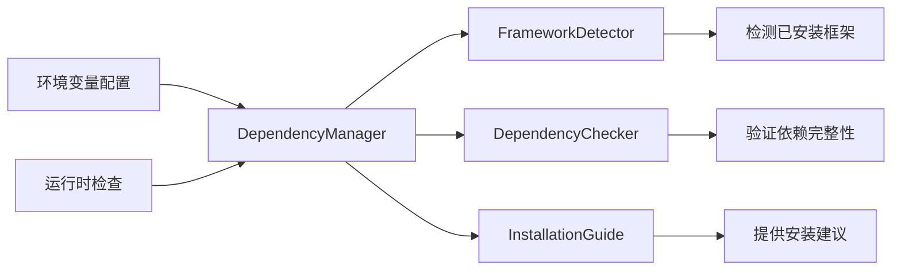

# Design Document

## Overview

本设计文档描述了web_performance_monitor包的框架特定依赖管理功能的技术实现方案。该功能将通过重构现有的依赖配置、实现运行时依赖检测机制、以及提供智能的依赖管理工具来解决当前强制安装所有框架依赖的问题。

核心设计理念是保持向后兼容性的同时，提供更灵活的依赖管理机制，让用户能够根据实际使用场景按需安装依赖。

## Architecture

### 高层架构

```mermaid
graph TB
    A[用户安装] --> B{安装类型}
    B -->|pip install web-performance-monitor| C[核心依赖]
    B -->|pip install web-performance-monitor[flask]| D[核心 + Flask依赖]
    B -->|pip install web-performance-monitor[fastapi]| E[核心 + FastAPI依赖]
    B -->|pip install web-performance-monitor[all]| F[所有依赖]
    
    C --> G[依赖检测器]
    D --> G
    E --> G
    F --> G
    
    G --> H[框架检测]
    H --> I[监控器工厂]
    I --> J[适配的监控器]
```

### 依赖管理架构



## Components and Interfaces

### 1. 依赖配置重构 (pyproject.toml)

**目标**: 重新组织依赖结构，将框架特定依赖移至可选依赖

**当前问题**: 
- Flask依赖在核心dependencies中
- 缺少aiofiles和aiohttp等异步依赖
- 没有细粒度的依赖分组

**新的依赖结构**:
```toml
[project]
dependencies = [
    "pyinstrument>=4.0.0",
    "requests>=2.25.0",
]

[project.optional-dependencies]
flask = [
    "flask>=2.0.0",
]
fastapi = [
    "fastapi>=0.100.0",
    "uvicorn>=0.20.0",
    "aiofiles>=24.1.0",
    "aiohttp>=3.12.0",
]
notifications = [
    "mattermostdriver>=7.0.0",
]
all = [
    "flask>=2.0.0",
    "fastapi>=0.100.0", 
    "uvicorn>=0.20.0",
    "aiofiles>=24.1.0",
    "aiohttp>=3.12.0",
    "mattermostdriver>=7.0.0",
]
```

**依赖影响说明**:
- **核心功能**: pyinstrument和requests是核心依赖，提供基础性能监控功能
- **框架支持**: flask/fastapi依赖只影响对应框架的监控功能
- **通知功能**: mattermostdriver只影响Mattermost通知，不安装时会自动禁用该通知渠道，其他通知方式（本地文件、邮件等）仍然可用
- **功能隔离**: 每个可选依赖组都是独立的，缺失时只影响对应功能，不会破坏整体系统

### 2. 依赖管理器 (DependencyManager)

**位置**: `web_performance_monitor/utils/dependency_manager.py`

**接口**:
```python
class DependencyManager:
    def __init__(self, config: Optional[Dict] = None):
        """初始化依赖管理器"""
        
    def check_framework_dependencies(self, framework: str) -> DependencyStatus:
        """检查特定框架的依赖状态"""
        
    def get_supported_frameworks(self) -> List[str]:
        """获取当前支持的框架列表"""
        
    def get_installation_guide(self, framework: str) -> str:
        """获取框架依赖安装指导"""
        
    def validate_environment(self) -> EnvironmentReport:
        """验证当前环境的依赖完整性"""
```

### 3. 框架检测器 (FrameworkDetector)

**位置**: `web_performance_monitor/utils/framework_detector.py`

**接口**:
```python
class FrameworkDetector:
    @staticmethod
    def detect_installed_frameworks() -> List[str]:
        """检测当前环境中已安装的框架"""
        
    @staticmethod
    def is_framework_available(framework: str) -> bool:
        """检查特定框架是否可用"""
        
    @staticmethod
    def get_framework_version(framework: str) -> Optional[str]:
        """获取框架版本信息"""
        
    @staticmethod
    def suggest_installation(missing_frameworks: List[str]) -> Dict[str, str]:
        """为缺失的框架提供安装建议"""
```

### 4. 运行时依赖检查器 (RuntimeDependencyChecker)

**位置**: `web_performance_monitor/core/dependency_checker.py`

**接口**:
```python
class RuntimeDependencyChecker:
    def __init__(self, strict_mode: bool = False):
        """初始化运行时依赖检查器"""
        
    def check_and_warn(self, required_framework: str) -> bool:
        """检查依赖并发出警告或异常"""
        
    def get_missing_dependencies(self, framework: str) -> List[str]:
        """获取缺失的依赖列表"""
        
    def should_skip_check(self) -> bool:
        """检查是否应跳过依赖检查"""
```

### 5. 增强的监控器工厂 (Enhanced MonitorFactory)

**位置**: `web_performance_monitor/monitors/factory.py` (修改现有)

**新增功能**:
```python
class MonitorFactory:
    @staticmethod
    def create_monitor_with_dependency_check(
        config: UnifiedConfig, 
        framework: Optional[str] = None,
        strict_dependencies: bool = False
    ) -> BaseWebMonitor:
        """创建监控器并进行依赖检查"""
        
    @staticmethod
    def get_available_monitors() -> Dict[str, bool]:
        """获取可用的监控器及其依赖状态"""
```

## Data Models

### 1. 依赖状态模型

```python
@dataclass
class DependencyStatus:
    framework: str
    is_available: bool
    missing_packages: List[str]
    installed_version: Optional[str]
    required_version: str
    installation_command: str

@dataclass
class EnvironmentReport:
    supported_frameworks: List[str]
    available_frameworks: List[str]
    dependency_statuses: Dict[str, DependencyStatus]
    recommendations: List[str]
    warnings: List[str]
```

### 2. 配置模型扩展

```python
@dataclass
class DependencyConfig:
    skip_dependency_check: bool = False
    strict_dependencies: bool = False
    auto_install_deps: bool = False
    preferred_frameworks: List[str] = field(default_factory=list)
```

## Error Handling

### 1. 新的异常类型

**位置**: `web_performance_monitor/exceptions/exceptions.py`

```python
class DependencyError(PerformanceMonitorError):
    """依赖相关错误的基类"""
    pass

class MissingDependencyError(DependencyError):
    """缺失依赖错误"""
    def __init__(self, framework: str, missing_packages: List[str]):
        self.framework = framework
        self.missing_packages = missing_packages
        super().__init__(f"Missing dependencies for {framework}: {', '.join(missing_packages)}")

class FrameworkNotSupportedError(DependencyError):
    """不支持的框架错误"""
    pass

class DependencyConflictError(DependencyError):
    """依赖冲突错误"""
    pass
```

### 2. 优雅降级策略

```python
class GracefulDegradation:
    @staticmethod
    def handle_missing_framework(framework: str, fallback_action: str = "warn"):
        """处理缺失框架的情况"""
        
    @staticmethod
    def provide_limited_functionality(available_features: List[str]):
        """在依赖不完整时提供有限功能"""
        
    @staticmethod
    def handle_missing_notification_deps():
        """处理通知依赖缺失，自动禁用对应通知渠道"""
```

**功能降级策略**:
- **缺失mattermostdriver**: 自动禁用Mattermost通知，保留其他通知方式
- **缺失框架依赖**: 提供基础监控功能，显示安装建议
- **部分依赖缺失**: 启用可用功能，明确标识不可用功能

## Testing Strategy

### 1. 单元测试

**测试文件**: `tests/test_dependency_management.py`

**测试覆盖**:
- 依赖检测逻辑
- 框架检测准确性
- 错误处理机制
- 环境变量配置

### 2. 集成测试

**测试文件**: `tests/test_dependency_integration.py`

**测试场景**:
- 不同安装组合的功能验证
- 多框架环境下的行为
- 依赖冲突处理
- 运行时检查机制

### 3. 模拟测试环境

```python
class MockEnvironment:
    """模拟不同的依赖安装环境"""
    
    def simulate_missing_flask(self):
        """模拟Flask未安装的环境"""
        
    def simulate_partial_fastapi(self):
        """模拟FastAPI部分依赖缺失的环境"""
        
    def simulate_clean_environment(self):
        """模拟只有核心依赖的环境"""
```

### 4. 性能测试

**测试目标**:
- 依赖检查的性能开销
- 框架检测的响应时间
- 内存使用情况

## Implementation Plan Integration

### 与现有代码的集成点

1. **__init__.py 修改**:
   - 添加条件导入逻辑
   - 集成依赖检查
   - 提供依赖状态API

2. **MonitorFactory 增强**:
   - 集成依赖检查逻辑
   - 添加错误处理
   - 支持优雅降级

3. **配置系统扩展**:
   - 添加依赖相关配置选项
   - 支持环境变量控制
   - 集成到UnifiedConfig

### 向后兼容性保证

1. **API兼容性**:
   - 保持现有公共API不变
   - 新功能通过可选参数提供
   - 默认行为保持一致

2. **配置兼容性**:
   - 现有配置继续有效
   - 新配置选项为可选
   - 提供迁移指导

3. **行为兼容性**:
   - 默认启用依赖检查但不阻断
   - 通过环境变量控制严格模式
   - 保持现有错误处理逻辑

## Security Considerations

1. **依赖验证**:
   - 验证包的完整性
   - 检查版本兼容性
   - 防止恶意包注入

2. **环境变量安全**:
   - 验证环境变量值
   - 防止配置注入攻击
   - 限制自动安装功能的使用场景

3. **错误信息安全**:
   - 避免泄露敏感路径信息
   - 限制错误信息的详细程度
   - 提供安全的调试选项