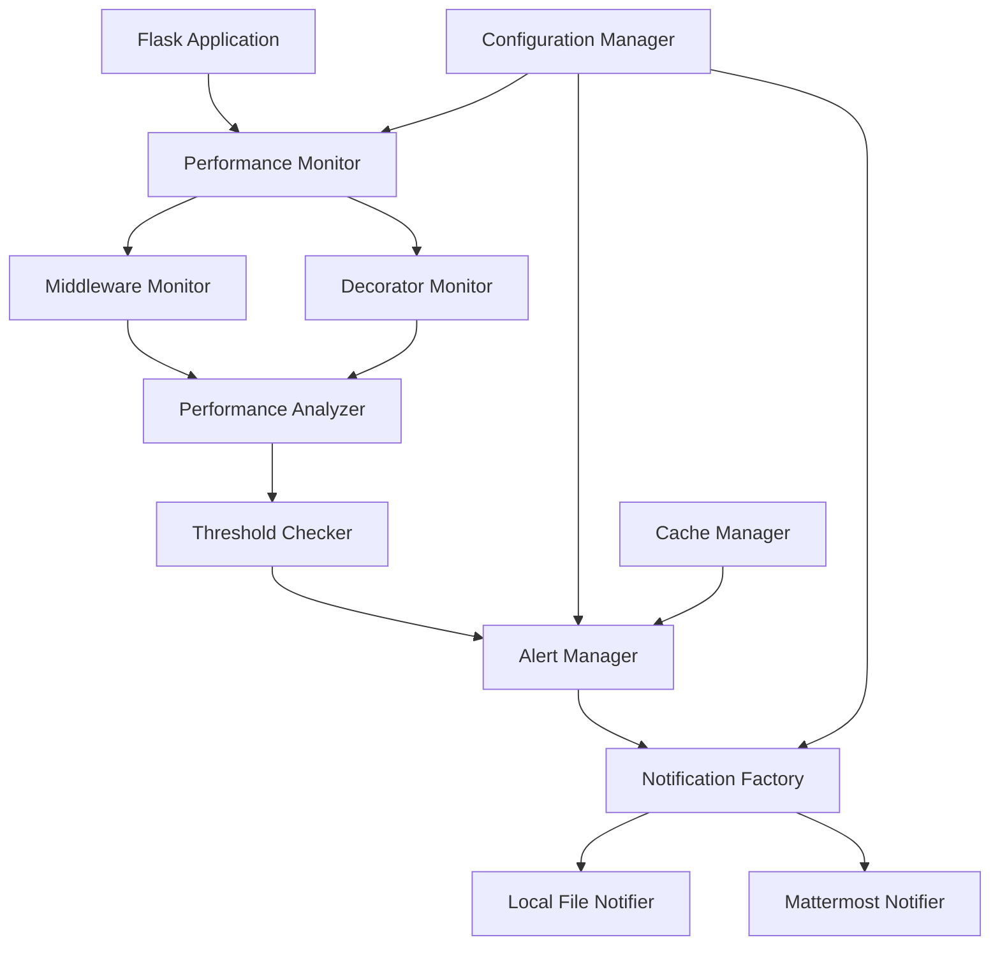

# Design Document

## Overview

Web性能监控工具是一个基于pyinstrument的Flask应用性能分析和告警系统，将打包为PyPI包便于第三方项目快速集成。该工具采用模块化设计，支持中间件和装饰器两种监控模式，提供本地文件和Mattermost两种通知方式。系统设计遵循零入侵原则，确保监控开销小于原接口响应时间的5%，并且对原有应用的性能和功能无影响。

**设计理念**：
- **零入侵监控**：通过中间件和装饰器模式实现无侵入性集成
- **性能优先**：监控工具本身的性能开销控制在5%以内
- **灵活配置**：支持环境变量和配置文件两种配置方式
- **扩展性设计**：基于抽象接口设计，便于扩展新的web框架和通知方式
- **容错机制**：所有监控和通知错误都不影响原应用正常运行

## Architecture

### 系统架构图



### 核心组件关系

- **Performance Monitor**: 主入口，提供中间件和装饰器接口
- **Performance Analyzer**: 使用pyinstrument进行性能分析
- **Threshold Checker**: 检查性能指标是否超过阈值
- **Alert Manager**: 管理告警逻辑和防重复机制
- **Notification Factory**: 创建不同类型的通知器
- **Configuration Manager**: 统一配置管理
- **Cache Manager**: 管理告警历史缓存

## Components and Interfaces

### 1. 核心监控组件

#### PerformanceMonitor (主监控类)
```python
class PerformanceMonitor:
    def __init__(self, config: Config):
        self.config = config
        self.analyzer = PerformanceAnalyzer()
        self.alert_manager = AlertManager(config)
        self._performance_overhead_tracker = PerformanceOverheadTracker()
    
    def create_middleware(self) -> Callable:
        """创建Flask中间件，自动监控所有HTTP请求"""
        def middleware(app):
            def wsgi_wrapper(environ, start_response):
                # 监控整个请求处理过程，包含请求URL、参数等信息
                return self._monitor_request(app, environ, start_response)
            return wsgi_wrapper
        return middleware
    
    def create_decorator(self) -> Callable:
        """创建性能监控装饰器，用于监控特定函数"""
        def decorator(func):
            def wrapper(*args, **kwargs):
                # 独立监控每个被装饰函数的性能
                return self._monitor_function(func, *args, **kwargs)
            return wrapper
        return decorator
    
    def _monitor_request(self, app, environ, start_response):
        """监控HTTP请求，确保零入侵和性能开销控制"""
        pass
    
    def _monitor_function(self, func, *args, **kwargs):
        """监控函数执行，保持原函数返回值和异常处理行为"""
        pass
```

#### PerformanceAnalyzer (性能分析器)
```python
class PerformanceAnalyzer:
    def start_profiling(self) -> Profiler:
        """开始pyinstrument性能分析"""
        pass
    
    def stop_profiling(self, profiler: Profiler) -> str:
        """停止分析并生成包含详细性能分析的HTML报告"""
        pass
    
    def get_execution_time(self, profiler: Profiler) -> float:
        """获取精确的执行时间"""
        pass
    
    def get_performance_overhead(self, original_time: float, monitored_time: float) -> float:
        """计算监控工具的性能开销百分比"""
        pass

class PerformanceOverheadTracker:
    """监控工具性能开销跟踪器，确保开销小于5%"""
    def __init__(self):
        self.overhead_samples = []
    
    def track_overhead(self, original_time: float, monitored_time: float) -> None:
        """跟踪性能开销"""
        pass
    
    def get_average_overhead(self) -> float:
        """获取平均性能开销百分比"""
        pass
```

### 2. 告警管理组件

#### AlertManager (告警管理器)
```python
class AlertManager:
    def __init__(self, config: Config):
        self.config = config
        self.cache_manager = CacheManager()
        self.notification_factory = NotificationFactory(config)
    
    def should_alert(self, endpoint: str, execution_time: float) -> bool:
        """判断是否应该发送告警
        - 检查响应时间是否超过配置阈值（默认1秒）
        - 检查同一接口在时间窗口内（默认10天）是否已告警
        """
        pass
    
    def send_alert(self, metrics: PerformanceMetrics, html_report: str) -> None:
        """发送告警通知，支持同时启用多种通知方式"""
        pass
    
    def _safe_send_notification(self, notifier: BaseNotifier, metrics: PerformanceMetrics, html_report: str) -> bool:
        """安全发送通知，确保通知失败不影响应用正常运行"""
        pass
```

#### CacheManager (缓存管理器)
```python
class CacheManager:
    def __init__(self):
        self._cache = {}  # 简单内存缓存
    
    def is_recently_alerted(self, key: str, window_days: int = 10) -> bool:
        """检查是否在配置的时间窗口内（默认10天）已告警"""
        pass
    
    def mark_alerted(self, key: str) -> None:
        """标记已告警，防止重复通知"""
        pass
    
    def generate_alert_key(self, endpoint: str, request_url: str, request_params: dict) -> str:
        """生成告警缓存键，基于接口、URL和参数"""
        pass
    
    def cleanup_expired_entries(self, window_days: int) -> None:
        """清理过期的缓存条目"""
        pass
```

### 3. 通知组件

#### 抽象基类
```python
from abc import ABC, abstractmethod

class BaseNotifier(ABC):
    @abstractmethod
    def send_notification(self, metrics: PerformanceMetrics, html_report: str) -> bool:
        """发送通知，返回是否成功"""
        pass
```

#### 具体实现
```python
class LocalFileNotifier(BaseNotifier):
    def __init__(self, output_dir: str = "/tmp"):
        self.output_dir = output_dir
    
    def send_notification(self, metrics: PerformanceMetrics, html_report: str) -> bool:
        """保存HTML报告到配置目录（默认/tmp）
        - 生成包含时间戳和接口名的唯一文件名避免冲突
        - 在日志中打印文件路径和请求摘要信息
        - 存储失败时记录错误日志但不影响应用运行
        """
        pass

class MattermostNotifier(BaseNotifier):
    def __init__(self, server_url: str, token: str, channel_id: str, max_retries: int = 3):
        self.server_url = server_url
        self.token = token
        self.channel_id = channel_id
        self.max_retries = max_retries
    
    def send_notification(self, metrics: PerformanceMetrics, html_report: str) -> bool:
        """发送HTML报告到Mattermost指定频道
        - 将HTML报告作为附件发送
        - 包含描述性消息：接口名称、请求URL、请求参数、响应时间和告警时间
        - 实施最多3次重试机制
        - 发送失败时记录错误日志但不影响应用运行
        """
        pass
    
    def _retry_send(self, metrics: PerformanceMetrics, html_report: str) -> bool:
        """重试发送机制"""
        pass
```

#### NotificationFactory (通知器工厂)
```python
class NotificationFactory:
    def __init__(self, config: Config):
        self.config = config
    
    def create_notifiers(self) -> List[BaseNotifier]:
        """根据配置创建通知器列表，支持同时启用多种通知方式"""
        pass
    
    def register_notifier_type(self, notifier_type: str, notifier_class: type) -> None:
        """注册新的通知器类型，支持扩展"""
        pass
```

### 4. 通知内容格式化

#### NotificationFormatter (通知格式化器)
```python
class NotificationFormatter:
    @staticmethod
    def format_alert_message(metrics: PerformanceMetrics) -> str:
        """格式化告警消息，包含请求URL、参数、响应时间等信息"""
        return f"""
        性能告警报告
        接口: {metrics.endpoint}
        请求URL: {metrics.request_url}
        请求参数: {json.dumps(metrics.request_params, ensure_ascii=False)}
        响应时间: {metrics.execution_time:.2f}秒
        告警时间: {metrics.timestamp.strftime('%Y-%m-%d %H:%M:%S')}
        请求方法: {metrics.request_method}
        状态码: {metrics.status_code}
        """
    
    @staticmethod
    def generate_filename(metrics: PerformanceMetrics) -> str:
        """生成包含时间戳和接口信息的唯一文件名"""
        timestamp = metrics.timestamp.strftime('%Y%m%d_%H%M%S')
        safe_endpoint = metrics.endpoint.replace('/', '_').replace('<', '').replace('>', '')
        return f"peralert_{safe_endpoint}.html"
```

### 5. 配置管理

#### Config (配置类)
```python
@dataclass
class Config:
    # 性能阈值配置
    threshold_seconds: float = 1.0  # 默认1秒阈值
    alert_window_days: int = 10     # 默认10天重复告警窗口
    max_performance_overhead: float = 0.05  # 最大5%性能开销
    
    # 本地文件配置
    enable_local_file: bool = True
    local_output_dir: str = "/tmp"
    
    # Mattermost配置
    enable_mattermost: bool = False
    mattermost_server_url: str = ""
    mattermost_token: str = ""
    mattermost_channel_id: str = ""
    mattermost_max_retries: int = 3
    
    @classmethod
    def from_env(cls) -> 'Config':
        """从环境变量加载配置，支持所有配置项的环境变量覆盖"""
        pass
    
    @classmethod
    def from_dict(cls, config_dict: dict) -> 'Config':
        """从配置文件字典加载配置"""
        pass
    
    @classmethod
    def from_file(cls, config_path: str) -> 'Config':
        """从配置文件加载配置"""
        pass
    
    def validate(self) -> None:
        """验证配置有效性，无效配置使用默认值并记录警告"""
        pass
    
    def get_effective_config(self) -> dict:
        """获取生效的配置信息，用于日志记录"""
        pass
```

## Data Models

### 1. 性能数据模型

```python
@dataclass
class PerformanceMetrics:
    endpoint: str
    request_url: str
    request_params: Dict[str, Any]
    execution_time: float
    timestamp: datetime
    request_method: str
    status_code: int
    profiler_data: Optional[str] = None
```

### 2. 告警记录模型

```python
@dataclass
class AlertRecord:
    endpoint: str
    request_url: str
    request_params: Dict[str, Any]
    alert_time: datetime
    execution_time: float
    notification_status: Dict[str, bool]  # 各通知方式的发送状态
```

### 3. 缓存数据模型

```python
@dataclass
class CacheEntry:
    key: str
    timestamp: datetime
    data: Any
    
    def is_expired(self, window_days: int) -> bool:
        """检查缓存是否过期"""
        pass
```

## Error Handling

### 1. 异常层次结构

```python
class PerformanceMonitorError(Exception):
    """基础异常类"""
    pass

class ConfigurationError(PerformanceMonitorError):
    """配置错误"""
    pass

class NotificationError(PerformanceMonitorError):
    """通知发送错误"""
    pass

class ProfilingError(PerformanceMonitorError):
    """性能分析错误"""
    pass
```

### 2. 错误处理策略

- **非阻塞原则**: 所有监控和通知错误都不应影响原应用的正常运行
- **优雅降级**: 当某个通知方式失败时，其他方式仍应正常工作
- **详细日志**: 记录所有错误信息，便于问题排查
- **重试机制**: 对于网络相关的通知失败，实现简单的重试逻辑

### 3. 具体处理方案

```python
def safe_execute(func: Callable, *args, **kwargs) -> Any:
    """安全执行函数，捕获所有异常"""
    try:
        return func(*args, **kwargs)
    except Exception as e:
        logger.error(f"Error in {func.__name__}: {e}")
        return None
```

## Testing Strategy

### 1. 单元测试

- **组件测试**: 每个核心组件的独立测试
- **Mock测试**: 使用mock对象测试外部依赖
- **配置测试**: 测试各种配置组合的正确性
- **异常测试**: 测试异常情况的处理

### 2. 集成测试

- **Flask集成**: 测试与Flask应用的集成效果
- **通知集成**: 测试各种通知方式的端到端流程
- **性能测试**: 验证监控工具本身不会显著影响性能

### 3. 测试工具和框架

- **pytest**: 主要测试框架
- **pytest-mock**: Mock功能
- **pytest-cov**: 代码覆盖率
- **Flask-Testing**: Flask应用测试支持

### 4. 测试数据和场景

```python
# 测试场景示例
test_scenarios = [
    {
        "name": "normal_request",
        "execution_time": 0.5,
        "should_alert": False
    },
    {
        "name": "slow_request",
        "execution_time": 2.0,
        "should_alert": True
    },
    {
        "name": "duplicate_alert",
        "execution_time": 2.0,
        "should_alert": False  # 重复告警
    }
]
```

### 5. 性能基准测试

- **基准测试**: 测量监控工具对应用性能的影响
- **负载测试**: 在高并发情况下的表现
- **内存测试**: 监控工具的内存使用情况

## PyPI Package Design

### 包发布要求

根据需求6，工具需要打包为PyPI包以便快速安装和使用：

#### setup.py配置
```python
from setuptools import setup, find_packages

setup(
    name="web-performance-monitor",
    version="1.0.0",
    description="基于pyinstrument的Flask应用性能监控和告警工具",
    long_description=open("README.md").read(),
    long_description_content_type="text/markdown",
    author="Your Name",
    author_email="your.email@example.com",
    url="https://github.com/yourusername/web-performance-monitor",
    packages=find_packages(),
    install_requires=[
        "pyinstrument>=4.0.0",
        "flask>=2.0.0",
        "mattermostdriver>=7.0.0",
        "requests>=2.25.0",
    ],
    extras_require={
        "dev": [
            "pytest>=6.0.0",
            "pytest-mock>=3.0.0",
            "pytest-cov>=2.0.0",
            "flask-testing>=0.8.0",
        ]
    },
    python_requires=">=3.7",
    classifiers=[
        "Development Status :: 4 - Beta",
        "Intended Audience :: Developers",
        "License :: OSI Approved :: MIT License",
        "Programming Language :: Python :: 3",
        "Programming Language :: Python :: 3.7",
        "Programming Language :: Python :: 3.8",
        "Programming Language :: Python :: 3.9",
        "Programming Language :: Python :: 3.10",
        "Framework :: Flask",
        "Topic :: Software Development :: Libraries :: Python Modules",
        "Topic :: System :: Monitoring",
    ],
)
```

#### 简洁的API接口设计
```python
# web_performance_monitor/__init__.py
from .monitor import PerformanceMonitor
from .config import Config
from .exceptions import PerformanceMonitorError, ConfigurationError

__version__ = "1.0.0"
__all__ = ["PerformanceMonitor", "Config", "PerformanceMonitorError", "ConfigurationError"]

# 提供便捷的快速启动函数
def quick_setup(threshold_seconds=1.0, enable_local_file=True, local_output_dir="/tmp"):
    """快速设置性能监控，使用默认配置"""
    config = Config(
        threshold_seconds=threshold_seconds,
        enable_local_file=enable_local_file,
        local_output_dir=local_output_dir
    )
    return PerformanceMonitor(config)
```

#### 安装和使用流程
```bash
# 安装
pip install web-performance-monitor

# 开发环境安装（包含测试依赖）
pip install web-performance-monitor[dev]
```

## Implementation Notes

### 1. PyPI包结构

```
web-performance-monitor/
├── setup.py                    # 标准PyPI包配置
├── README.md                   # 清晰的使用文档和示例
├── requirements.txt            # 依赖项：pyinstrument、mattermostdriver、flask等
├── MANIFEST.in                 # 包含额外文件
├── web_performance_monitor/
│   ├── __init__.py            # 简洁的API接口导出
│   ├── monitor.py             # 主监控类，支持中间件和装饰器
│   ├── analyzer.py            # 性能分析器和开销跟踪
│   ├── alerts.py              # 告警管理和缓存
│   ├── notifiers/
│   │   ├── __init__.py
│   │   ├── base.py           # 抽象基类接口
│   │   ├── local_file.py     # 本地文件通知器
│   │   ├── mattermost.py     # Mattermost通知器
│   │   └── factory.py        # 通知器工厂
│   ├── config.py             # 配置管理，支持环境变量和文件
│   ├── utils.py              # 工具函数
│   └── exceptions.py         # 异常定义
├── tests/
│   ├── __init__.py
│   ├── test_monitor.py       # 中间件和装饰器测试
│   ├── test_analyzer.py      # 性能分析测试
│   ├── test_alerts.py        # 告警逻辑测试
│   ├── test_notifiers.py     # 通知器测试
│   ├── test_config.py        # 配置管理测试
│   └── test_integration.py   # 集成测试
└── examples/
    ├── flask_middleware_example.py    # 中间件使用示例
    ├── decorator_example.py           # 装饰器使用示例
    └── config_examples/               # 配置示例
        ├── env_config.py
        └── file_config.py
```

### 2. 使用示例

#### 中间件模式 - 自动监控所有HTTP请求
```python
from flask import Flask
from web_performance_monitor import PerformanceMonitor, Config

app = Flask(__name__)

# 支持环境变量和配置文件两种配置方式
config = Config.from_env()  # 或 Config.from_file('config.json')
# 也可以直接配置
config = Config(
    threshold_seconds=1.0,              # 自定义响应时间阈值
    alert_window_days=10,               # 重复告警时间窗口
    enable_local_file=True,             # 启用本地文件通知
    local_output_dir="/tmp/reports",    # 自定义输出目录
    enable_mattermost=True,             # 启用Mattermost通知
    mattermost_server_url="your-server.com",
    mattermost_token="your-token",
    mattermost_channel_id="channel-id"
)

monitor = PerformanceMonitor(config)
# 中间件自动监控所有HTTP请求，零入侵集成
app.wsgi_app = monitor.create_middleware()(app.wsgi_app)

@app.route('/api/users')
def get_users():
    # 业务逻辑 - 会被自动监控
    return {"users": []}
```

#### 装饰器模式 - 监控特定函数
```python
from web_performance_monitor import PerformanceMonitor, Config

config = Config(threshold_seconds=0.5)
monitor = PerformanceMonitor(config)

@monitor.create_decorator()
def slow_function(param1, param2):
    # 关键业务逻辑 - 独立监控
    # 保持原函数返回值和异常处理行为
    return process_data(param1, param2)

@monitor.create_decorator()
def another_critical_function():
    # 另一个需要监控的函数
    pass
```

#### 配置示例
```python
# 环境变量配置
import os
os.environ['WPM_THRESHOLD_SECONDS'] = '2.0'
os.environ['WPM_ALERT_WINDOW_DAYS'] = '7'
os.environ['WPM_ENABLE_MATTERMOST'] = 'true'
os.environ['WPM_MATTERMOST_SERVER_URL'] = 'https://mattermost.example.com'

config = Config.from_env()

# 配置文件示例 (config.json)
{
    "threshold_seconds": 1.5,
    "alert_window_days": 14,
    "enable_local_file": true,
    "local_output_dir": "/var/log/performance",
    "enable_mattermost": false
}
```

### 3. 扩展性设计

基于抽象接口的扩展性设计，遵循开闭原则：

#### Web框架扩展
```python
# 抽象基类定义
class BaseWebFrameworkMonitor(ABC):
    @abstractmethod
    def create_middleware(self) -> Callable:
        """创建框架特定的中间件"""
        pass

# Flask实现
class FlaskMonitor(BaseWebFrameworkMonitor):
    def create_middleware(self) -> Callable:
        # Flask特定实现
        pass

# 未来可扩展Django、FastAPI等
class DjangoMonitor(BaseWebFrameworkMonitor):
    def create_middleware(self) -> Callable:
        # Django特定实现
        pass
```

#### 通知方式扩展
```python
# 通过继承BaseNotifier轻松添加新通知方式
class SlackNotifier(BaseNotifier):
    def send_notification(self, metrics: PerformanceMetrics, html_report: str) -> bool:
        # Slack通知实现
        pass

class EmailNotifier(BaseNotifier):
    def send_notification(self, metrics: PerformanceMetrics, html_report: str) -> bool:
        # 邮件通知实现
        pass

# 通过工厂模式注册新通知器
notification_factory.register_notifier_type('slack', SlackNotifier)
```

#### 配置驱动的监控策略
- **阈值策略**: 支持不同接口配置不同阈值
- **采样策略**: 支持配置采样率减少性能开销
- **过滤策略**: 支持配置忽略特定接口或路径
